<div>
    
      <div>
        
    </div>
</div>

# Vanilla Toast
A toast library for vanilla lovers :heartpulse:.

## Toast
Provides all the functions possible to render a toast notification.
- `default` - renders a neutral, black and white toast.
- `success` - renders a check icon beside the toast message.
- `error` - renders an x icon beside the toast message.
- `info` - renders an i icon beside the toast message.
- `warn` - renders a warning icon beside the toast message.
- `loading` - renders a loading icon beside the toast message and cannot be closed unless specified.
- `promise` - handles promises for you and renders a loading toast. Once the promise is finished, then changes the toast to either a success toast or error toast and sets a timer to close the toast. This also returns the error instead of throwing it.
- `dismiss` - dismisses a toast.

## Why vanilla toast?
Well, with all the amount of frameworks out there, it's become overwhelming. They are great tools, yes, but the abstraction is crazy and I did not get a change to learn about the lower level APIs like EventSource, Websocket, Clusters for concurrency, ArrayBuffers, etc. That's why I decided to make this toast library to make my life easier when I develop client-side apps with Vanilla JavaScript. Besides, I will be able to freely explore Vanilla JS and understand how libraries like React work under the hood in a clearer view.

## Features
- Dependency Free
- Follows the ARIA Conventions as much as possible
- Stackable toasts
- Smooth movements

## Showcase

A video of showing how the toasts are rendered:

https://github.com/Ragudos/vanilla-toast/assets/133567781/306e5d59-f0c7-4c5e-91d5-d9edaf818990

- neutral:

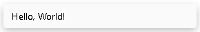

- success:

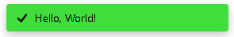
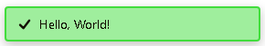
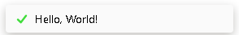

- error:

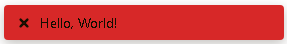

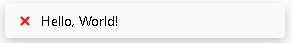

- info:

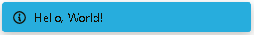
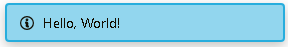
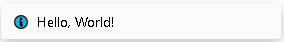

- warn:

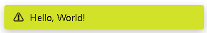
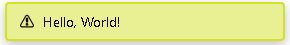
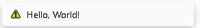

- loading:

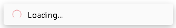
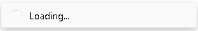
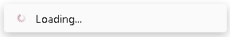
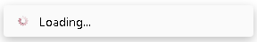
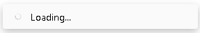

## Installation

npm:

```bash
  npm install @webdevaaron/vanilla-toast
```

pnpm:

```bash
  pnpm install @webdevaaron/vanilla-toast
```

## How to use

1. From your main JavaScript file, import the necessary files:

```ts
  import { toast, mount_toaster } from "@vanilla-toast/vanilla-toast";
  import "@vanilla-toast/vanilla-toast/build/index.min.css";
```

2. Mount the toast container:

```ts
  // You can pass in options to this function.
  mount_toaster();

  // or
  window.addEventListener("DOMContentLoaded", () => {
    mount_toaster();
  });
```

3. To render a toast, you can do:

```ts
  // Neutral
  toast.default({ message: "Hello, World!" });

  // Success
  toast.success({ messsage: "Hello, World!" });

  // Error
  toast.error({ message: "Hello, World!" });

  // Promise
  const response = await toast.promise(fetch, "https://jsonplaceholder.typicode.com/posts");
  
  if (!(response instanceof Error)) {
    const data = response.json();

    console.table(data);
  }

  // And other methods...
```

4. Have fun!

There are various options to assign to a toast. API References to guide you are coming up soon when the website for this library becomes live.

### LICENSE
MIT License

Copyright (c) 2023 Aaron

Permission is hereby granted, free of charge, to any person obtaining a copy
of this software and associated documentation files (the "Software"), to deal
in the Software without restriction, including without limitation the rights
to use, copy, modify, merge, publish, distribute, sublicense, and/or sell
copies of the Software, and to permit persons to whom the Software is
furnished to do so, subject to the following conditions:

The above copyright notice and this permission notice shall be included in all
copies or substantial portions of the Software.

THE SOFTWARE IS PROVIDED "AS IS", WITHOUT WARRANTY OF ANY KIND, EXPRESS OR
IMPLIED, INCLUDING BUT NOT LIMITED TO THE WARRANTIES OF MERCHANTABILITY,
FITNESS FOR A PARTICULAR PURPOSE AND NONINFRINGEMENT. IN NO EVENT SHALL THE
AUTHORS OR COPYRIGHT HOLDERS BE LIABLE FOR ANY CLAIM, DAMAGES OR OTHER
LIABILITY, WHETHER IN AN ACTION OF CONTRACT, TORT OR OTHERWISE, ARISING FROM,
OUT OF OR IN CONNECTION WITH THE SOFTWARE OR THE USE OR OTHER DEALINGS IN THE
SOFTWARE.
