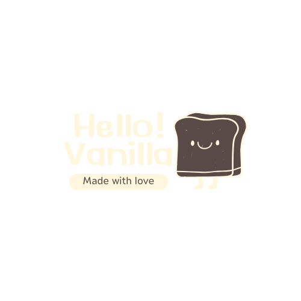

    
     
    

        
        
        
        
    

# Vanilla Toast
A toast library for vanilla lovers :heartpulse:.

## Why vanilla toast?
Well, with all the amount of frameworks out there, it's become overwhelming. They are great tools, yes, but the abstraction is crazy and I did not get a change to learn about the lower level APIs like EventSource, Websocket, Clusters for concurrency, ArrayBuffers, etc. That's why I decided to make this toast library to make my life easier when I develop client-side apps with Vanilla JavaScript.

This library will be up to ARIA accessibility standards as much as possible. The few uses implemented already are:

- role attributes
- aria-live attributes
- prefers-reduced-motion listener

## Features
- Dependency Free
- Customizable
- Follows the ARIA Conventions as much as possible
- Built in animations, such as:
  - popup
  - fade-in
  - slide-down
  - slide-left
  - slide-right
  -slide-up

## LICENSE
MIT License

Copyright (c) 2023 Aaron

Permission is hereby granted, free of charge, to any person obtaining a copy
of this software and associated documentation files (the "Software"), to deal
in the Software without restriction, including without limitation the rights
to use, copy, modify, merge, publish, distribute, sublicense, and/or sell
copies of the Software, and to permit persons to whom the Software is
furnished to do so, subject to the following conditions:

The above copyright notice and this permission notice shall be included in all
copies or substantial portions of the Software.

THE SOFTWARE IS PROVIDED "AS IS", WITHOUT WARRANTY OF ANY KIND, EXPRESS OR
IMPLIED, INCLUDING BUT NOT LIMITED TO THE WARRANTIES OF MERCHANTABILITY,
FITNESS FOR A PARTICULAR PURPOSE AND NONINFRINGEMENT. IN NO EVENT SHALL THE
AUTHORS OR COPYRIGHT HOLDERS BE LIABLE FOR ANY CLAIM, DAMAGES OR OTHER
LIABILITY, WHETHER IN AN ACTION OF CONTRACT, TORT OR OTHERWISE, ARISING FROM,
OUT OF OR IN CONNECTION WITH THE SOFTWARE OR THE USE OR OTHER DEALINGS IN THE
SOFTWARE.
